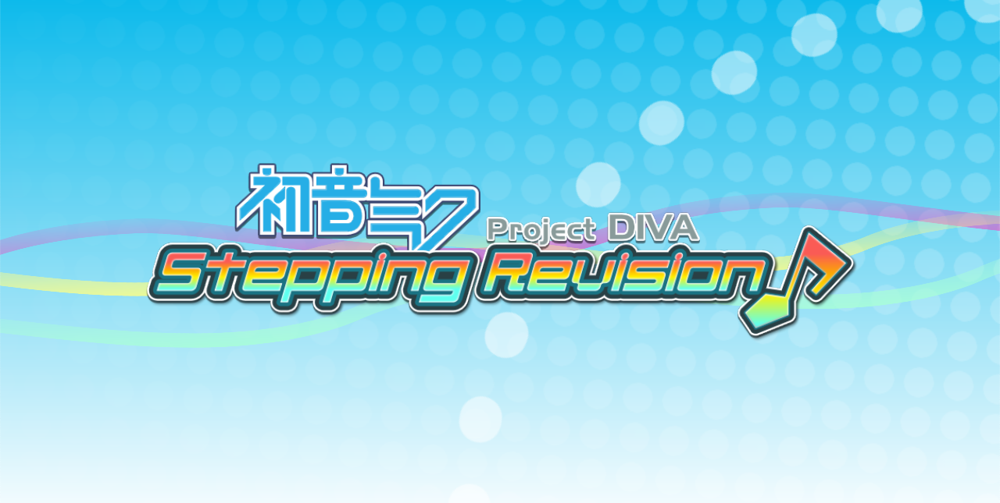

# Project Diva: Stepping Revision Project

## Purpose
The entire purpose of this little project is to make a Theme for StepMania that goes around the style of the Project Diva games, while giving it its own spin on it. It is mostly a 1st and Append mix of styles right now. Later on I plan on adding more.

## Compatibility
The theme works completely fine with 5.0.12 and 5.1 Beta 1/2.
5.2 is untested, and definetly this does NOT work on Etterna, so don't even bother trying.

## Character Models
Alongside this theme, I'm also porting some of the Project Diva models so they can be used as Dancing Characters in StepMania. This is to acommodate alongside one of the menu features in PD:SR, which is the inclusion of a random character inside a room in the menu background.

## Background models
This is still being decided about, as I have converted some models from Mirai to see how much it would affect perfomance in StepMania, and some of them do affect it a lot. Like seriously. So eventually, only a selected list of stages will be available.

More information about some of the features are available on the wiki, which is regularly updated when new stuff is added.